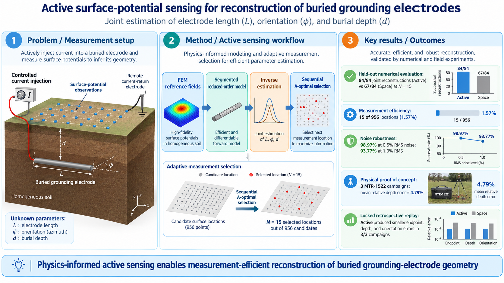

# Active Surface-Potential Measurement Design for Buried Grounding Electrodes

[](https://doi.org/10.5281/zenodo.22894304)

<p align="center">
  
</p>

Reproducibility companion for the manuscript:

**Active Surface-Potential Measurement Design for Physics-Informed Reconstruction of Buried Grounding Electrodes**

Author: Alexandre Giacomelli Leal

## Version status

The current archived release is **v1.2.1**, available on Zenodo under DOI **10.5281/zenodo.22894304**.

Version v1.2.1 completes the v1.2.0 reproducibility package by adding the full post-hoc benchmark archive, including the complete 200-layout Random casewise results and the D-optimal and numerical full-grid casewise results. No scientific results, methods, or manuscript conclusions were changed.

## Numerical chronology

- 16 cases were used as a fixed development sentinel.
- The final measurement budget was frozen at **N = 15** after the predeclared seven-layout seed-robustness test.
- The remaining 84 cases were evaluated once and are consumed.
- The additive-noise Monte Carlo experiment was defined after disclosure of the held-out results; it is secondary and is not a new independent held-out validation.
- D-optimal, Random-200, and full-grid analyses were added later as post-hoc comparative benchmarks without modifying the original A-optimal method.

## Key numerical results

At **N=15**:

- A-optimal Active: **84/84** joint success.
- D-optimal: **84/84** joint success.
- Deterministic Space: **67/84** joint success.
- Random, 200 layouts: median **70/84**, P10-P90 **64/84-78/84**, observed range **61/84-82/84**; no layout reached 84/84.
- Full grid, 956 locations: **84/84** joint success; reported only as a dense-data reference.

The expanded comparison supports the broader value of information-driven OED rather than unique superiority of the A-optimal scalar criterion.

Post-held-out additive potential-noise stress:

- 0.5% RMS: Active **98.97%**, Space **18.65%**.
- 1.0% RMS: Active **93.77%**, Space **6.94%**.

## Additional acquisition benchmarks

Compact benchmark material is available under `data/posthoc_benchmarks/`.

The GitHub repository includes the manuscript-level comparison table, Random-200 distribution summary, convergence-by-prefix table, the frozen Random-200 extension protocol, and a portable aggregation script. The complete per-layout/per-case Random ensemble and casewise D-optimal/full-grid results are archived in the v1.2.1 Zenodo release.

## Physical proof of concept

The physical material is under `physical_validation/`. The source workbook `comparacao_real_MTR1522_D020_D030_D040_FINAL.xlsx`, containing the three 17x17 MTR-1522 field campaigns, remains at repository root.

The physical package contains:

- physical provenance records;
- deterministic full-grid v5-M80 protocol, reconstruction results, sensitivity result, and workbook-based reproducer;
- physical map-comparison metric reproduction, including the reference-normalized `R2_ref` convention;
- the retrospective sequential Active-vs-Space replay protocol, preflight/hash records, N=15 results, all-checkpoint results, paired comparison, summary, and selected-point sequence.

Because the sparse replay used previously acquired complete maps, it is reported as **retrospective transfer evidence**, not prospective field validation.

At N=15, the retrospective replay gives mean relative depth error 0.585% for Active versus 71.39% for Space, and mean endpoint error 0.0931 m versus 0.2129 m, respectively.

## Repository layout

- `src/fem/` — gauge-aware FEM convergence audit, M1 ceiling diagnostic, and segmented-surrogate diagnostic.
- `src/noise_stress/` — frozen v5-M80 numerical inverse/acquisition core and noise-stress tooling.
- `protocols/` — frozen numerical held-out, noise-stress, and Random-200 extension protocols.
- `data/doe/` — deterministic DOE.
- `data/heldout_final/` — original held-out Active-versus-Space summaries.
- `data/noise_stress/` — post-held-out noise-stress tables.
- `data/posthoc_benchmarks/` — compact D-optimal, Random-200, Space, A-optimal, and full-grid comparison material.
- `scripts/` — numerical verification, figure reproduction, and Random-200 aggregation scripts.
- `docs/` — chronology and reproducibility documentation.
- `physical_validation/fullgrid/` — physical full-grid inversion protocol, results, and reproducer.
- `physical_validation/locked_replay/` — retrospective sparse replay protocol, audit records, and principal results.
- `physical_validation/reproduce_physical_map_metrics.py` — physical map metric reproducer using the source workbook.

## Quick numerical verification

Python 3.11+ is recommended.

```bash
python -m pip install -r requirements.txt
python scripts/reconstruct_master100_doe.py
python scripts/validate_results.py
python scripts/reproduce_all_figures.py
python physical_validation/reproduce_physical_map_metrics.py
```

For the complete Random-200 casewise CSV from the Zenodo archive:

```bash
python scripts/summarize_random200.py --input RANDOM200_ALL_CASEWISE.csv --outdir random200_summary
```

The full-grid physical inverse can be rerun with:

```bash
python physical_validation/fullgrid/src/reproduce_fullgrid_main.py
```

## MATLAB/COMSOL environment

The frozen MATLAB studies were run with MATLAB R2025b. The FEM reference model used COMSOL Multiphysics 5.3 with LiveLink for MATLAB.

Paper-level numerical claims can be checked from derived CSV tables without COMSOL. Re-executing the FEM generation itself requires the original COMSOL model and a licensed COMSOL environment.

## Data scope

The GitHub repository contains the compact numerical reproducibility core and physical proof-of-concept material. The large Random-200 casewise ensemble and the complete casewise D-optimal/full-grid benchmark tables are archived in Zenodo v1.2.1.

The complete corpus of all 84 COMSOL-generated 956-point fields is not included in the compact public repository.

## License

Code and bundled derived data are released under the MIT License unless a file states otherwise.

## Citation

**Leal, Alexandre Giacomelli. Active Surface-Potential Measurement Design for Physics-Informed Reconstruction of Buried Grounding Electrodes: Reproducibility Package, v1.2.1. Zenodo. https://doi.org/10.5281/zenodo.22894304**
